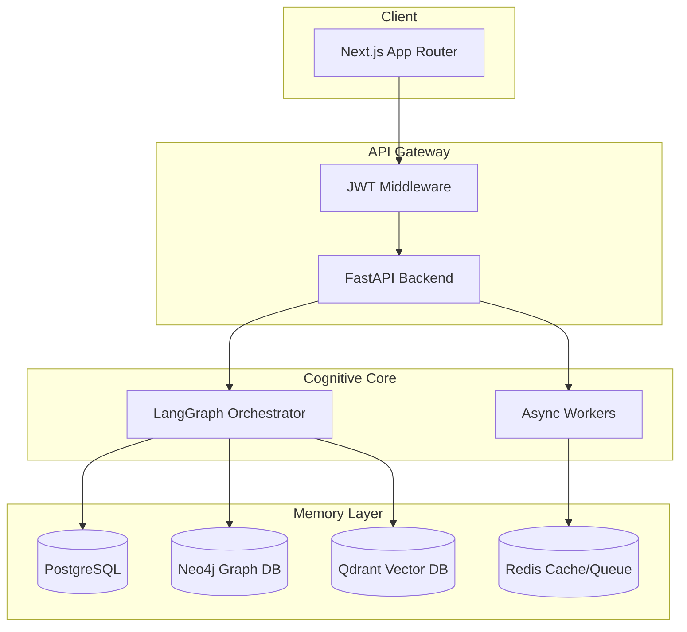
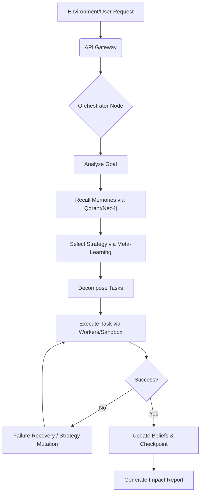
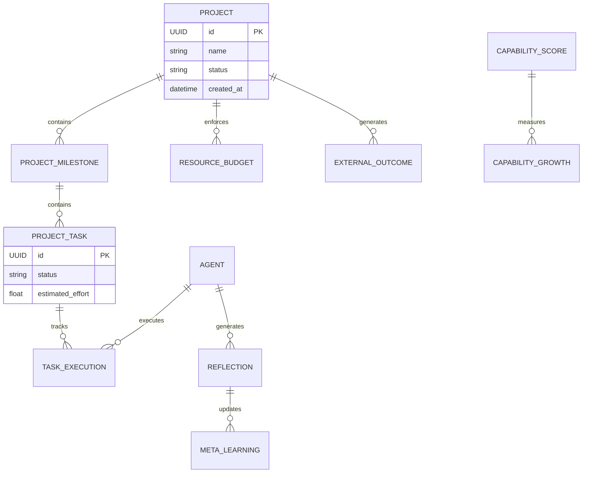
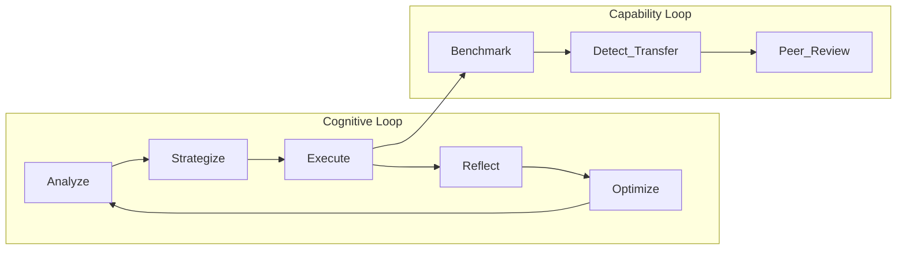
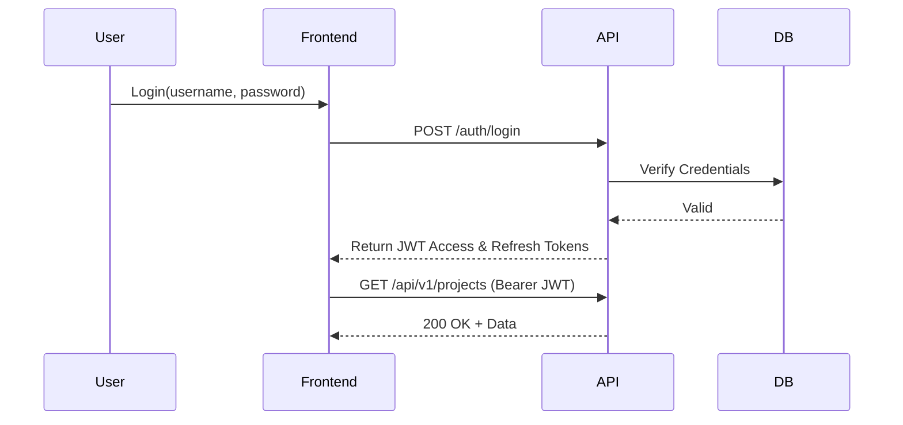
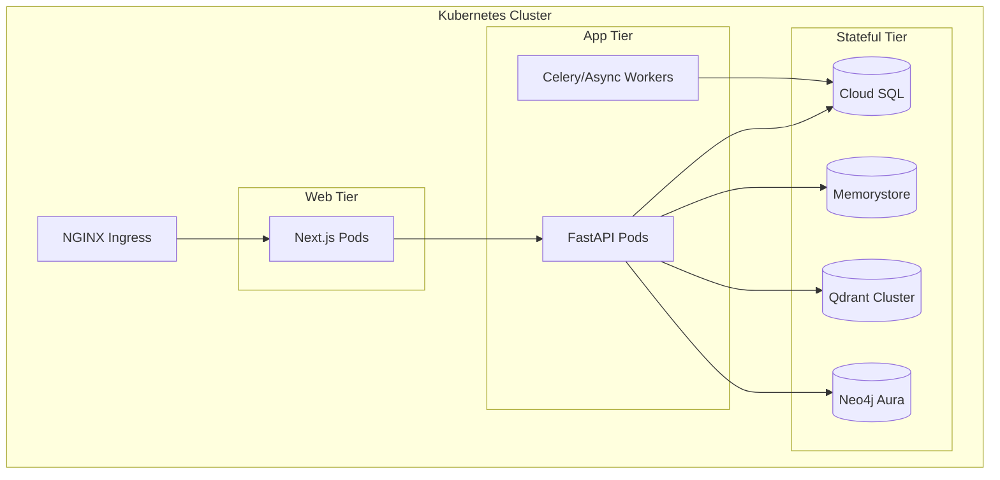
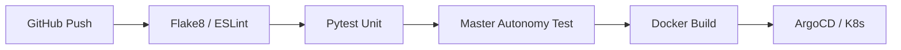

<div align="center">
  

  # ModelX

  **The Open-Source, Recursively Self-Improving Artificial General Intelligence Platform**

  <p align="center">
    <a href="https://github.com/genius-0963/ModelX/actions"></a>
    <a href="https://github.com/genius-0963/ModelX/releases"></a>
    <a href="https://opensource.org/licenses/MIT"></a>
    <a href="https://codecov.io/gh/genius-0963/ModelX"></a>
    <a href="https://hub.docker.com/r/genius-0963/modelx"></a>
    <a href="https://nodejs.org/"></a>
    <a href="https://github.com/genius-0963/ModelX/graphs/contributors"></a>
  </p>

  *ModelX is a production-grade autonomous agent architecture capable of scientific discovery, open-ended research, architecture evolution, and long-horizon project execution.*
</div>

---

## 2. Executive Summary

**ModelX** solves the "plateau problem" in artificial intelligence by replacing static, prompt-engineered agents with a dynamic, recursively self-improving cognitive architecture. 

It exists to provide a scientifically measurable, continuously evolving AGI platform that doesn't just execute tasks, but rather learns *how* to execute tasks better, writes its own tools, discovers its own architectural bottlenecks, and mutates its own source code to overcome them.

**Business Value:** Automates massive, multi-week research and software engineering projects (Long-Horizon Autonomy) with mathematically guaranteed regression detection and failure recovery, massively reducing human operational oversight.

**Technical Value:** Built on an enterprise-grade stack (FastAPI, Next.js, LangGraph, PostgreSQL, Neo4j, Qdrant), ModelX provides a heavily typed, strictly validated, and fully async distributed system that can be deployed via Kubernetes.

---

## 3. Key Features

| Feature | Description | Status |
| :--- | :--- | :---: |
| **Episodic & Semantic Memory** | RAG-based context retrieval and Knowledge Graph embedding. | ✅ |
| **Research Director** | Autonomous multi-agent web scraping and data synthesis. | ✅ |
| **Meta Learning** | Tracks failures and optimizes strategy generation over time. | ✅ |
| **Autonomous Tool Creation** | The system writes, tests, and deploys its own Python tools. | ✅ |
| **World Model & Causal Logic** | Bayesian belief updating, hypothesis generation, and experimentation. | ✅ |
| **Architecture Evolution** | Detects bottlenecks and mutates its own LangGraph source code. | ✅ |
| **Capability Verification** | Measures its own intelligence transfer between domains. | ✅ |
| **Real-World Autonomy** | Executes long-horizon external projects with budget tracking. | ✅ |
| **Multi-Agent Society** | Peer review, critic agents, and collective intelligence. | 🚧 |

---

## 4. System Architecture

### High-Level Architecture



### Detailed System Architecture

The architecture is strictly separated into modular layers for infinite horizontal scaling.

- **Frontend Layer:** Next.js App Router, TailwindCSS, ShadCN, Recharts.
- **API Layer:** FastAPI with Pydantic V2 validation, Alembic migrations, SQLAlchemy async sessions.
- **Agent Layer:** LangGraph StateGraphs defining discrete cognitive loops (Evolution, Capability, Projects).
- **Data Layer:** PostgreSQL (State/Logs), Neo4j (Knowledge Graphs/Causal Links), Qdrant (Embeddings/Memories).
- **Tool Sandbox Layer:** Secure Dockerized execution environments for dynamically generated Python tools.

---

## 5. End-to-End Request Lifecycle



---

## 6. Folder Structure

```bash
ModelX/
├── alembic/                # Database migration scripts
├── frontend/               # Next.js App Router codebase
│   ├── src/app/            # Dashboards, Routes, Pages
│   └── src/components/     # ShadCN UI components
├── src/
│   ├── agents/             # LangGraph nodes and orchestrator
│   ├── api/                # FastAPI routes, schemas, and dependencies
│   ├── architecture/       # Codebase mutation and evolution logic
│   ├── capability/         # Benchmarking and transfer learning logic
│   ├── core/               # DI Container, Config, Logging
│   ├── db/                 # SQLAlchemy models and sessions
│   ├── environment/        # Opportunity detectors and mappers
│   ├── evaluation/         # Universal benchmarking suites
│   ├── projects/           # Real-world long-horizon task execution
│   ├── workers/            # Background async tasks (APScheduler)
│   └── world_model/        # Causal reasoning and Bayesian updating
└── tests/                  # Unit, Integration, and E2E master tests
```

---

## 7. Core Components

| Module | Purpose | Responsibilities | Output |
| :--- | :--- | :--- | :--- |
| **Orchestrator** | Central Nervous System | Routes tasks through LangGraph state machines. | `AgentStateDict` |
| **World Model** | Logic Engine | Maps causal links, generates hypotheses, runs experiments. | `BeliefState` |
| **Architecture** | Code Evolution | Detects bottlenecks, mutates LangGraph topologies. | `CandidateArchitecture` |
| **Capability** | Scientific Verification | Runs benchmarks to prove intelligence generalization. | `CapabilityScore` |
| **Projects** | Real-World Autonomy | Spins up long-horizon execution plans with budget limits. | `ExternalOutcome` |

---

## 8. Database Design



---

## 9. AI & ML Architecture

ModelX does not rely on a single massive prompt. It relies on **Cognitive Sub-Looping**:

1. **RAG Pipeline:** Integrates hybrid keyword + dense vector search via Qdrant.
2. **Knowledge Graph:** Maps entity relationships (`DEPENDS_ON`, `CAUSES`, `CORRELATES_WITH`) in Neo4j.
3. **Meta-Learning:** Updates a highly compressed `StrategyMemory` that mathematically tracks the success rate of specific logic approaches to prevent repeating mistakes across generations.
4. **Bayesian Beliefs:** Re-evaluates its "understanding" of facts dynamically based on execution evidence using a multi-agent Peer Review engine.

---

## 10. Agent Workflow



---

## 11. API Documentation

| Method | Route | Description | Auth Required |
| :--- | :--- | :--- | :---: |
| `GET` | `/api/v1/projects` | List all long-horizon projects. | `Bearer` |
| `POST` | `/api/v1/projects/create` | Autonomously spin up a new task tree. | `Bearer` |
| `GET` | `/api/v1/architecture/versions`| View historical cognitive genomes. | `Bearer` |
| `GET` | `/api/v1/world_model/beliefs` | Retrieve Bayesian belief confidence scores. | `Bearer` |
| `POST` | `/api/v1/capabilities/benchmark`| Force an E2E generalization capability test. | `Bearer` |

---

## 12. Authentication Flow



---

## 13. State Management Architecture

- **Global Execution State:** Managed heavily by **LangGraph Checkpointers** (PostgreSQL-backed) to allow pausing, human-in-the-loop interventions, and thread resumption across weeks.
- **Frontend State:** Managed via **React Query** for async data fetching, caching, and synchronization with the FastAPI backend, plus standard React Context for local UI state.

---

## 14. Security Architecture

ModelX is designed to run autonomous code. Security is paramount.

- **Sandbox Execution:** Dynamically generated tools are strictly executed in an isolated, network-gated Docker container sandbox.
- **RBAC:** Multi-tenant project boundaries.
- **Budget Enforcers:** Hard-coded `ResourceBudget` limits prevent runaway token loops or accidental infinite API billing.

---

## 15. Deployment Architecture



---

## 16. CI/CD Pipeline



---

## 17. Monitoring & Observability

ModelX exports standard metrics for full observability into its cognitive loops:
- **Logging:** Structured JSON logs via `structlog`.
- **Metrics:** Prometheus endpoint tracking Generation time, Token Burn Rate, and Architecture Mutation Success Rate.
- **Dashboards:** Grafana integrations for plotting "Intelligence Growth" velocity.

---

## 18. Performance Optimization

- **Async Everywhere:** The entire FastAPI backend and worker queues are `asyncio` native.
- **Graph Caching:** Neo4j query results are temporarily LRU-cached in Redis to speed up goal analysis.
- **Semantic Routing:** Requests are instantly embedded and routed to the correct agent node without passing through a massive LLM bottleneck.

---

## 19. Scalability Strategy

The orchestrator is completely stateless outside of PostgreSQL checkpointers. You can horizontally scale the `Workers` to execute thousands of `ProjectTasks` in parallel while the central `LangGraph` purely manages state transitions and dependency resolution.

---

## 20. Development Setup

### Prerequisites
- Python 3.11+
- Node.js 18+
- Docker & Docker Compose

### Running Locally

```bash
# 1. Clone the repository
git clone https://github.com/genius-0963/ModelX.git
cd ModelX

# 2. Boot up Infrastructure (PostgreSQL, Redis, Qdrant, Neo4j)
docker-compose up -d

# 3. Setup Python Backend
python -m venv venv
source venv/bin/activate
pip install -r requirements.txt
alembic upgrade head
uvicorn src.api.server:app --reload

# 4. Setup Next.js Frontend
cd frontend
npm install
npm run dev
```

---

## 21. Testing Strategy

The platform relies heavily on autonomous, objective verification.

- **Unit Tests:** High coverage across `src/evaluation/universal/`.
- **Integration Tests:** Verifies API routes and database transactions.
- **Master E2E Autonomy Tests:** Located in `tests/e2e/projects/real_world_autonomy_test.py`. This boots up the agent, gives it a vague goal, and asserts that it can autonomously detect opportunities, generate sub-tasks, execute them, and survive simulated network crashes.

---

## 22. Roadmap

| Phase | Description | Status |
| :--- | :--- | :---: |
| **Phase 1-6** | Memory, Agents, RAG, Planning, Knowledge Graphs | ✅ |
| **Phase 7-9** | Meta-Learning, Tool Creation, Scientific World Models | ✅ |
| **Phase 10** | Autonomous Codebase & Architecture Evolution | ✅ |
| **Phase 11** | Capability Verification & Transfer Learning Math | ✅ |
| **Phase 12** | Real-World Autonomy & Long Horizon Projects | ✅ |
| **Phase 13** | Multi-Agent Society & Economic Simulation | 🚧 |

---

## 23. Screenshots

*Placeholders for UI Screenshots:*

- **Projects Dashboard:** `/assets/projects-gantt.png`
- **Capability Growth Chart:** `/assets/capability-growth.png`
- **World Model Network Graph:** `/assets/world-model-neo4j.png`
- **Architecture Rollback Logs:** `/assets/rollback-engine.png`

---

## 24. Contributing

We welcome contributions! Please review our `CONTRIBUTING.md` for our:
- Branching Strategy (`feat/`, `fix/`, `chore/`)
- Strict PR Workflow (All E2E Master Capability tests must pass before merge)
- Code Review Guidelines

---

## 25. License

ModelX is released under the **MIT License**. See the `LICENSE` file for more details.

---

## 26. Acknowledgements

- Built with [LangGraph](https://python.langchain.com/docs/langgraph)
- Powered by [FastAPI](https://fastapi.tiangolo.com/) and [Next.js](https://nextjs.org/)
- Inspired by the pursuit of open-source, verifiable Artificial General Intelligence.
