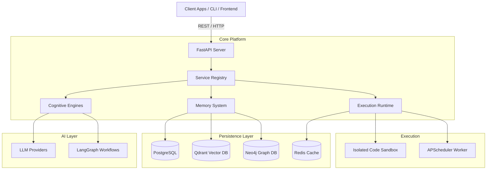
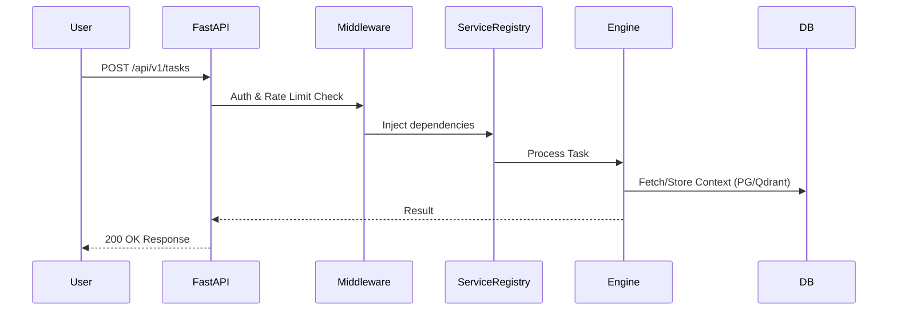

# 3. Architecture Analysis

ModelX employs a microservices-inspired, highly decoupled internal architecture built around FastAPI and LangGraph, backed by polyglot persistence.

## Overall System Architecture

The architecture relies on a multi-tier persistence model connected to a centralized API, which orchestrates various cognitive engines.

## Component Relationships

- **Service Registry (`src/core/service_registry.py`)**: Acts as the central nervous system, lazily loading and managing singletons of `PerformanceTracker`, `LearningVelocityTracker`, `CognitionReflectionAgent`, `FailureAnalyzer`, `MetaLearningEngine`, etc.
- **API (`src/api/main.py`)**: Mounts highly segmented routers (Goals, Tasks, Memory, Knowledge, Reflections, Meta, Vision, Swarm).
- **Execution Engine**: Leverages LangGraph for stateful workflow execution, with PostgreSQL (`langgraph-checkpoint-postgres`) providing checkpointing and recovery.

## API Request Lifecycle

## Data Persistence Strategy

The system utilizes specialized databases for different data shapes:
1. **PostgreSQL**: Relational data, user accounts, agent metadata, configuration, execution checkpoints.
2. **Qdrant**: High-dimensional vector embeddings for semantic search, RAG, and semantic memory.
3. **Neo4j**: Graph relationships, knowledge lineage, and conceptual mapping.
4. **Redis**: Ephemeral cache, rate limiting, and fast key-value lookups.

## Sandboxing & Execution
Code execution is isolated via a dedicated Docker container (`sandbox` service in `docker-compose.yml`), constrained with `no-new-privileges`, memory limits, and a read-only filesystem (with a `tmpfs` volume), ensuring the host system is protected from maliciously generated or buggy agent code.
