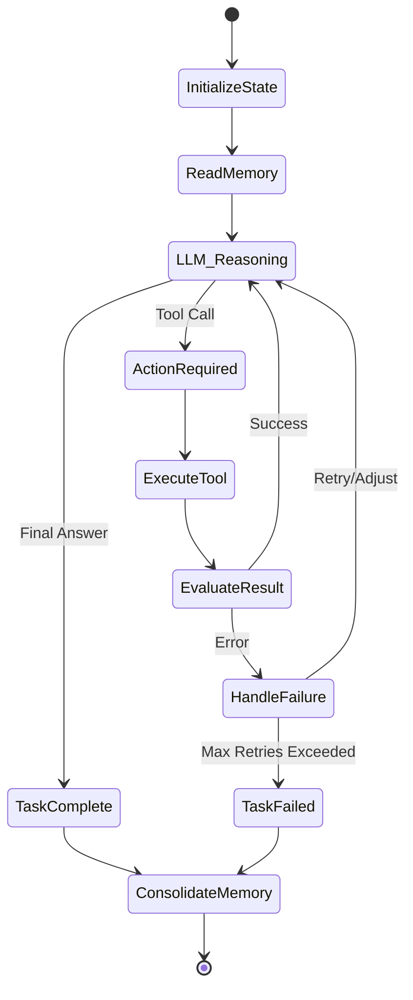

# 9. Workflow & Execution Engine Report

ModelX leverages a stateful, graph-based execution engine built on top of **LangGraph**, providing robust workflow management for autonomous agents.

## Execution Runtime

Located in `src/runtime/`, the execution loop (`execution_loop.py`) is the heartbeat of the agent. It translates high-level goals into directed acyclic graphs (DAGs) of tasks.

### Core Components
- **Agent Runtime (`agent_runtime.py`)**: Manages the lifecycle of an individual agent, including capability binding and memory loading.
- **Task Runtime (`task_runtime.py`)**: Executes specific tasks using the bound tools and LLM.
- **Execution Loop (`execution_loop.py`)**: The main while-loop that steps through the LangGraph state machine, checking conditions, triggering tool calls, and awaiting LLM responses.

## LangGraph Integration
ModelX uses LangGraph to define the cognitive flow. This provides several massive advantages:
1. **Statefulness:** The entire state of the reasoning process (messages, tool outputs, intermediate thoughts) is maintained in a typed state object.
2. **Checkpointing & Recovery:** By using `langgraph-checkpoint-postgres`, the execution engine automatically checkpoints its state to PostgreSQL after every node execution. If the platform crashes, the agent can resume exactly where it left off.
3. **Branching & Concurrency:** Complex workflows can branch conditionally (e.g., if a tool fails, branch to the `failure_analyzer` node).
4. **Human-in-the-Loop:** Checkpoints allow execution to pause and wait for human approval before proceeding with sensitive actions.

## Execution Diagram

